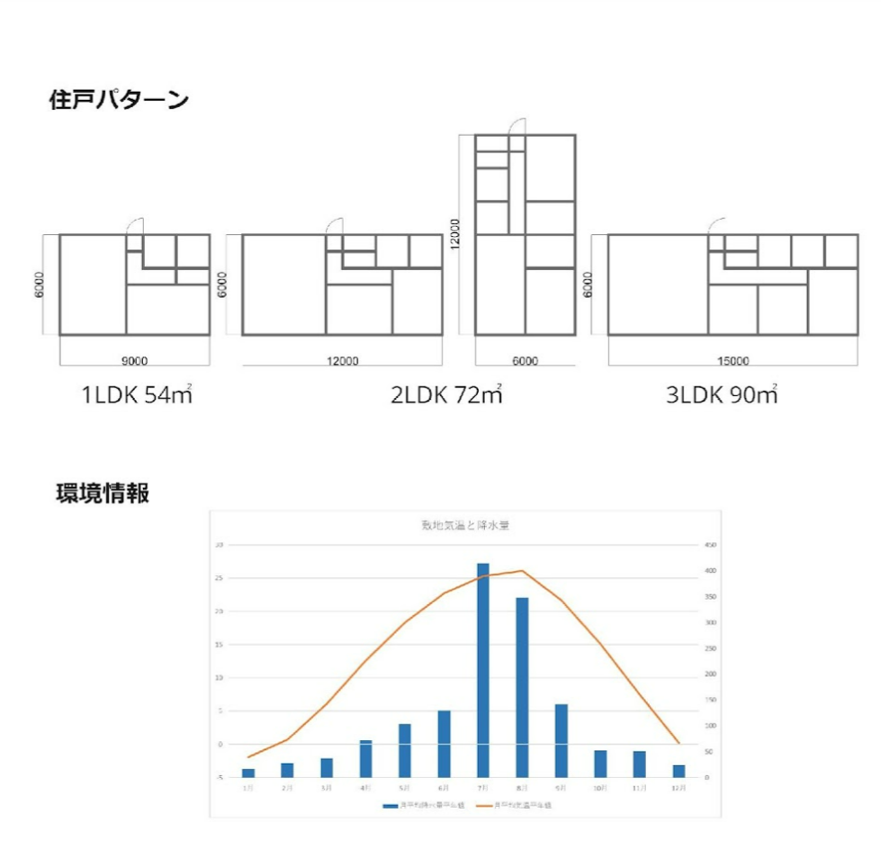

# 100世帯が暮らす傾斜地の集合住宅

情報建築学会fes2024でのレポート

[TutorialMarathon](https://www.youtube.com/live/Xx6kCp-JjZA?feature=shared&t=3475)

# 課題：100世帯が暮らす傾斜地の集合住宅

- 海外の山間部に研究施設が計画され、その家族が住まう集合住宅を設計します。
- 将来的に施設は拡張されるため、住民は増加する可能性があります
- 様々な住まいや、住民の健康的な暮らしを促進するためのプログラム、空間を持続可能性を踏まえて提案してください。

### パラメータ/拘束条件

- 住戸数　１００住戸
- 住戸パターン数（４種類）
- 住戸ユニット基準寸法WDH（LDK形式ごと）
    - １LDK　9000×6000×4000
    - ２LDK　12000×6000×4000（横住戸）
    - ２LDK　6000×12000×4000（縦住戸）
    - ３LDK　15000×6000×4000
- 敷地形状
- 傾斜（２５度以下までOK）
- 低層（４階程度）

### 5Step+α

Stepに従って、設計を進めます。

## Step1　与条件整理、目標設定

チームはまず、傾斜地の事例集めを行いました。

> https://data.shinkenchiku.online/projects/articles/SK_2015_10_088-0
https://data.shinkenchiku.online/projects/articles/SK_2015_04_078-0
https://data.shinkenchiku.online/projects/articles/SK_2008_06_136-0
https://data.shinkenchiku.online/projects/articles/SK_2002_04_204-0
https://www.beta-architecture.com/stone-terrace-resort-hotel-enota/
https://www.madoarchitects.com/en/projects/41
https://www.domusweb.it/en/news/2014/10/21/holcim_awards_africamiddleeast.html
https://colocal.jp/topics/think-japan/local-action/20191220_131226.html
https://a2mstudio.com/admir/
https://onni.com/evelyn/architecture/
> 

事例で集めた、移動手段や環境配慮、等高線との付き合い方などのヒントをもとに、チームは移動手段をメインに課題を解いていくということを決めました。

山間部の課題として以下のものを整理しました。

1. 斜面の移動の負担
    
    
    
2. 住民によるニーズの違い
    
    
    
3. 山間部の環境問題
    
    
    

## Step2　敷地分析

敷地の分析として日射分析、傾斜分析を行いました。

### 日射分析

濃い赤色になればなるほど一年を通じて日射が当たります。

### 傾斜分析

傾斜分析では、傾斜角度に応じて25度以上は赤色に、それ以下は黄色、緑、青の順に平坦な角度に配色されています。

### 提案：移動手段で動線を分ける

これらの分析と与件整理の結果、課題解決のための方法を設定しました。それは、移動手段ごとに動線を分けるというアプローチです。具体的には、動線アルゴリズムを用いて3度、10度、30度の3つの角度を設定しました。この角度設定は、それぞれ異なる移動手段を想定しています。具体的には、3度は車いすや自転車の移動に、10度は自動車やバイクの移動に、そして30度は人が階段を使用して移動する場合を想定しています。

### 動線アルゴリズム

このアルゴリズムは、地形上に点を連続的に配置し、目標とする傾斜角度を持つ動線を探し出すことを目的としています。各点の選び方と制約条件を次のように定義します。

- **点の選び方**
    
    まず最初に一つの点を取り、その点を基準として新たな点を選ぶ際に、傾斜角度の最大値が決まっています。この最大値の範囲内で、新しい点を見つけます。
    
- **制約条件**
    
    新しい点を選ぶとき、一つ前の点からあまり近くにならないようにするために、一定の距離以上離れた場所に新しい点を置く必要があります。この距離の制約により、同じ場所に点を密集させないようにします。
    

- **例外処理**
    
    ただし、条件に合う点が見つからない場合には、全方向から点を探してもよいとします。このルールにより、システムが止まってしまうことを防ぎます。
    

## Step3　ボリュームスタディ

動線と、高低差などに合わせて、どのようなボリュームがうまく配置されるかのスタディを行いました。

1.ボリューム配置
2.３０度の導線部分を切り抜く
3.半分で高低さに合わせてずらす
4.住戸配置

1.ボリューム配置
2.高低差に合わせて押し込む
3.30度の導線をくりぬく

## Step4　住戸レイアウト

先に動線を引き、その後その土地の傾斜などを考慮したボリュームを配置しました。その際に、できた空間を様々な用途で、使用もできます。

## Step5　住戸をずらす

ボリュームを配置した後、**そのボリュームに対して自動的に配置された住戸**を空間に合うように住戸をずらしました。

横にずらすことで、同じ棟の人々と、交流が生まれます。また、奥にずらすことで、交流スペースに庇が生まれたり、日射の確保が可能です。

動線と、住戸の配置のダイアグラム動画

[diagram.mp4](https://prod-files-secure.s3.us-west-2.amazonaws.com/9a9f7002-2ff6-47c1-916d-2a83368215e5/a3ed06cf-81ce-4760-90df-e87b8939ac92/diagram.mp4)

## Step +α　拡張性とアクティビティ

住戸の空間を埋めるように、山間部ならではのアクティビティも楽しめる空間を考えました。

## まとめ

なかなか1週間で、まとめ切るのに苦労しました。僕の担当は動線アルゴリズムだったので、それを前面に押し出して行けたのはよかったなと思ってます。下の画像を見てわかる通り、このアルゴリズム通りに道に幅を追加して引くと、あり得ない角度のものや急カーブが生じるので現実的ではなかったです。そこもちょっと、講評会で指摘されました。プレゼンで、ボリューム配置から住戸生成の過程のアルゴリズムを説明できてなかったのはマイナスポイントですね。自動で住戸が配置されるというのは一番面白いポイントだったのに、住戸配置に頭が行っちゃってて、完全に忘れてました。そもそもの課題を知らない人に対してあまり優しくないプレゼンだったと思います。あと、自分はかなりえーとって言っちゃてて後から見返してかなり聞きづらい説明ですね。反省です。寝てなくて頭が回ってないっていうのもあるんだけど。

講評であった、下りのアルゴリズムもまた機会があれば考えてみたい。
